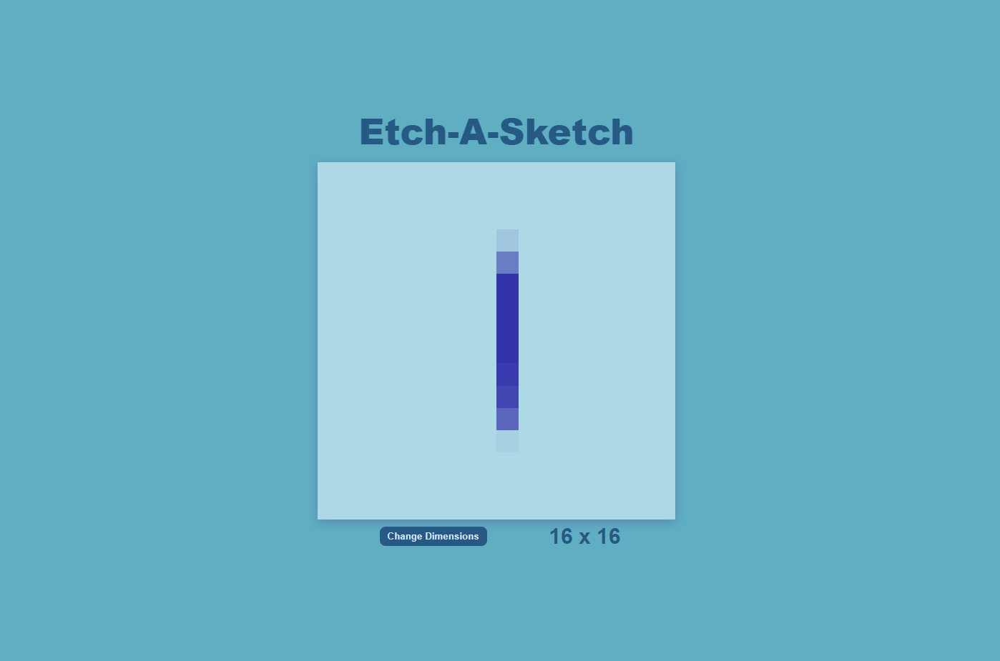

# Etch-a-Sketch

Live Demo:
https://leo-tsant.github.io/Etch-a-Sketch/

## Overview

This project was created for the [Etch-a-Sketch assignment](https://leo-tsant.github.io/etch-a-sketch/) as part of [The Odin Project](https://www.theodinproject.com/). Built using HTML, CSS, and JavaScript, this project allows users to draw on a grid by moving their mouse over the cells.
